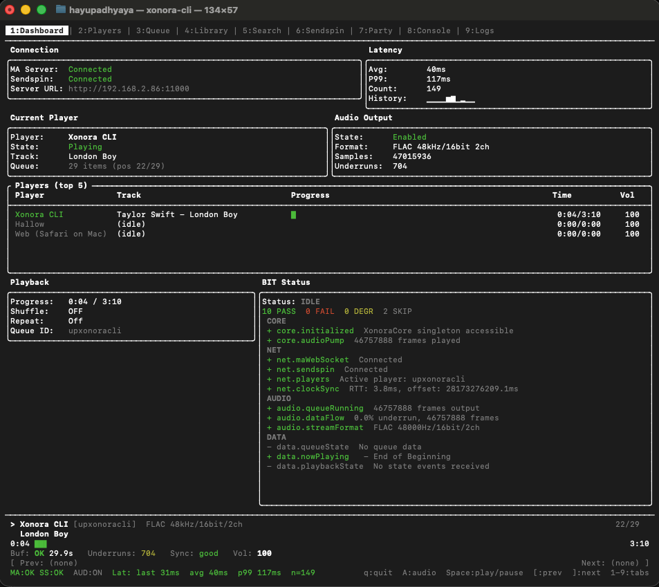

<p align="center">
  
</p>

<h1 align="center">xonora-cli</h1>

<p align="center">
  A native C++ terminal client for <a href="https://music-assistant.io/">Music Assistant</a>.<br/>
  Gapless, lossless, low-latency playback from your self-hosted MA server — straight from your terminal.
</p>

<p align="center">
  <a href="https://github.com/hayupadhyaya/xonora-cli/releases/latest"></a>
  
  <a href="https://discord.gg/x6cWh4AjNG"></a>
</p>

---

## What is Xonora?

**Xonora** is a high-performance, native client suite for [Music Assistant](https://music-assistant.io/) — the self-hosted music server that unifies Spotify, Apple Music, Plex, Jellyfin, local libraries, and more behind one API. Xonora ships native apps for **iOS, watchOS, and CarPlay**, and a **cross-platform C++ terminal CLI** for macOS, Linux, and Windows (via WSL). Android and tvOS clients are in development.

All clients share a custom audio engine (**SendspinKit** on Apple platforms, **xonora-core** in C++) that delivers gapless, synchronized, lossless playback with NTP-style clock sync against your MA server.

## What is xonora-cli?

`xonora-cli` is the terminal client — a single self-contained executable that:

- Connects directly to your Music Assistant server over WebSocket
- Decodes FLAC / PCM / Opus streams natively and plays them through the OS audio stack (CoreAudio / ALSA / WASAPI via [miniaudio](https://miniaud.io/))
- Renders a full-screen TUI (FTXUI) with dashboard, library, queue, search, logs, and a built-in Party mode
- Supports multi-speaker control and clock-synchronized playback

No Electron, no web view, no background daemon — just a ~5 MB binary.



## Supported Platforms          

<!-- BEGIN:PLATFORMS -->
- **macOS** arm64, x86_64 — macOS 12 (Monterey) or newer (universal binary)
- **Linux** x86_64, arm64 — Fedora, Ubuntu 22.04+, Debian 12+, Arch, RHEL 8+ (glibc 2.28+); only `libasound2` required
- **Windows** x86_64 — Windows 10/11 via WSL2 (runs the Linux x86_64 binary; native Windows build planned for a future release)
<!-- END:PLATFORMS -->                                                                                                              

## Features

- **9-tab TUI** — Dashboard, Players, Queue, Library, Search, Sendspin, Party, Console, Logs
- **Native audio** — FLAC, PCM, Opus decoders feeding the OS audio stack (miniaudio: CoreAudio / ALSA / WASAPI) at the stream's native sample rate
- **Cross-platform** — single codebase builds for macOS (universal), Linux (x86_64 + arm64), and Windows (via WSL2)
- **Gapless playback** with 5s pre-decode buffer and NTP-style clock sync
- **Built-In Test (BIT) panel** — live health checks across CORE, NET, AUDIO, DATA subsystems
- **Multi-player control** — drive any MA player (phone, web, Sonos, etc.) from your terminal
- **Party mode** — host or join a shared listening session with other Xonora clients

See the [Wiki](https://github.com/hayupadhyaya/xonora-cli/wiki) for full feature docs and keybindings.

## Requirements

- **macOS 12 (Monterey) or later**, **Linux** (glibc 2.28+ — Fedora, Ubuntu 22.04+, Debian 12+, Arch, RHEL 8+), or **Windows 10/11 via WSL2**
- A reachable **Music Assistant** server (schema 28+) with the **Sendspin** provider enabled
- Terminal with true-color support (Terminal.app, iTerm2, Alacritty, kitty, WezTerm, Windows Terminal all work)
- Linux only: `libasound2` runtime (pre-installed on most desktop distros)

## Installation           
                                                                                                                                      
<!-- BEGIN:INSTALL -->
### macOS

```bash
brew install hayupadhyaya/xonora/xonora-cli
```

Or download directly:

```bash
curl -L -o xonora-cli.tar.gz \
  https://github.com/hayupadhyaya/xonora-cli/releases/download/cli-v0.2.0/xonora-cli-v0.2.0-macos-universal.tar.gz
tar -xzf xonora-cli.tar.gz && sudo mv xonora-cli-v0.2.0-macos-universal/xonora-cli /usr/local/bin/
```

### Linux

```bash
ARCH=$(uname -m); [ "$ARCH" = "aarch64" ] && ARCH=arm64
curl -L -o xonora-cli.tar.gz \
  https://github.com/hayupadhyaya/xonora-cli/releases/download/cli-v0.2.0/xonora-cli-v0.2.0-linux-${ARCH}.tar.gz
tar -xzf xonora-cli.tar.gz && sudo mv xonora-cli-v0.2.0-linux-${ARCH}/xonora-cli /usr/local/bin/
```

### Windows (via WSL2)

Native Windows builds are not yet available. Install [WSL2](https://learn.microsoft.com/en-us/windows/wsl/install) with an Ubuntu distribution, then follow the **Linux x86_64** instructions above inside your WSL2 shell. Full functionality is supported.
<!-- END:INSTALL -->  

## Downloads                           
                                       
<!-- BEGIN:DOWNLOADS -->
Latest release: **v0.2.0** — [release notes](https://github.com/hayupadhyaya/xonora-cli/releases/tag/cli-v0.2.0)

| Platform | Architecture | Download |
|----------|--------------|----------|
| macOS | universal (arm64 + x86_64) | [xonora-cli-v0.2.0-macos-universal.tar.gz](https://github.com/hayupadhyaya/xonora-cli/releases/download/cli-v0.2.0/xonora-cli-v0.2.0-macos-universal.tar.gz) |
| Linux | x86_64 | [xonora-cli-v0.2.0-linux-x86_64.tar.gz](https://github.com/hayupadhyaya/xonora-cli/releases/download/cli-v0.2.0/xonora-cli-v0.2.0-linux-x86_64.tar.gz) |
| Linux | arm64 | [xonora-cli-v0.2.0-linux-arm64.tar.gz](https://github.com/hayupadhyaya/xonora-cli/releases/download/cli-v0.2.0/xonora-cli-v0.2.0-linux-arm64.tar.gz) |
| Checksums | all | [SHA256SUMS](https://github.com/hayupadhyaya/xonora-cli/releases/download/cli-v0.2.0/SHA256SUMS) |

Windows users: run the Linux x86_64 binary inside WSL2 — see the Installation section.
<!-- END:DOWNLOADS -->  

### Roadmap

- **Native Windows build** — deferred; currently via WSL2. See roadmap on the Discord.
- **Homebrew tap** — coming soon.

## Quick start

First run (credentials are saved to the OS-standard config path: `~/Library/Application Support/xonora/config.json` on macOS, `~/.config/xonora/config.json` on Linux):

```sh
xonora-cli --server ws://192.168.1.50:8095 --user USERNAME --pass PASSWORD
# or with a token
xonora-cli --server ws://192.168.1.50:8095 --token YOUR_TOKEN
```

Subsequent runs:

```sh
xonora-cli                              # reuse saved server + credentials
xonora-cli --name "Kitchen Mac"         # override CLI's display name in MA
xonora-cli --audio                      # enable local audio on launch
xonora-cli --help                       # all flags
```

Inside the TUI:

| Key       | Action                    |
|-----------|---------------------------|
| `1`–`9`   | Switch tabs               |
| `Space`   | Play / Pause              |
| `[` / `]` | Previous / Next track     |
| `A`       | Toggle local audio output |
| `q`       | Quit                      |

Full keybinding reference: [Wiki → Keybindings](https://github.com/hayupadhyaya/xonora-cli/wiki/Keybindings).

## Known issues (v0.2)

- **PCM & Opus silent** — only FLAC currently produces audio. PCM fallback (bit_depth=0→16) landed; Opus decoder configure may fail on some servers. Use FLAC output format in MA until fixed.
- **Remote (WebRTC) mode disabled** — not shipped in v0.2 binaries. LAN-only access for now.
- **Dashboard queue/playback panel** — some MA event types update the Logs tab but do not refresh the Dashboard summary until a full event cycle passes.
- **Native Windows** — deferred; Windows users run the Linux x86_64 binary inside WSL2 (full functionality).

See [Wiki → Troubleshooting](https://github.com/hayupadhyaya/xonora-cli/wiki/Troubleshooting) for workarounds.

## License

**Proprietary & closed-source.** The `xonora-cli` binary is distributed free of charge for personal, non-commercial use with Music Assistant. Source code is not publicly available. No warranty. All rights reserved © Hay Upadhyaya.

## Third-party dependencies

`xonora-cli` statically links the following open-source libraries. Full license texts are bundled inside the release tarball under `licenses/`.

| Library | Version | License | Purpose |
|---------|---------|---------|---------|
| [FTXUI](https://github.com/ArthurSonzogni/FTXUI) | 5.0.0 | MIT | Terminal UI |
| [IXWebSocket](https://github.com/machinezone/IXWebSocket) | 11.4.6 | BSD-3-Clause | WebSocket client |
| [miniaudio](https://miniaud.io/) | 0.11.21 | MIT-0 / Public domain | Cross-platform audio output |
| [libFLAC](https://github.com/xiph/flac) | 1.4.3 | BSD-3-Clause (Xiph) | FLAC decode |
| [libopus](https://github.com/xiph/opus) | 1.5.2 | BSD-3-Clause (Xiph) | Opus decode |
| [nlohmann/json](https://github.com/nlohmann/json) | 3.11.3 | MIT | JSON parsing |
| [qrcodegen](https://github.com/nayuki/QR-Code-generator) | 1.8.0 | MIT | QR code rendering |

## Community & support

- **Discord** — <https://discord.gg/x6cWh4AjNG>
- **Issues** — <https://github.com/hayupadhyaya/xonora-cli/issues>
- **Music Assistant project** — <https://music-assistant.io/>

---

<p align="center">Developed by Hay Upadhyaya. Not affiliated with Music Assistant or any streaming service.</p>
